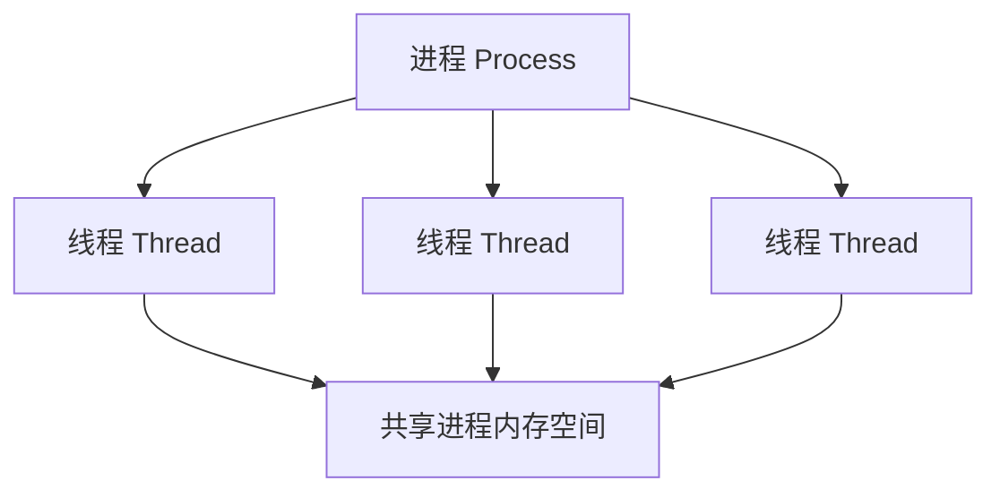
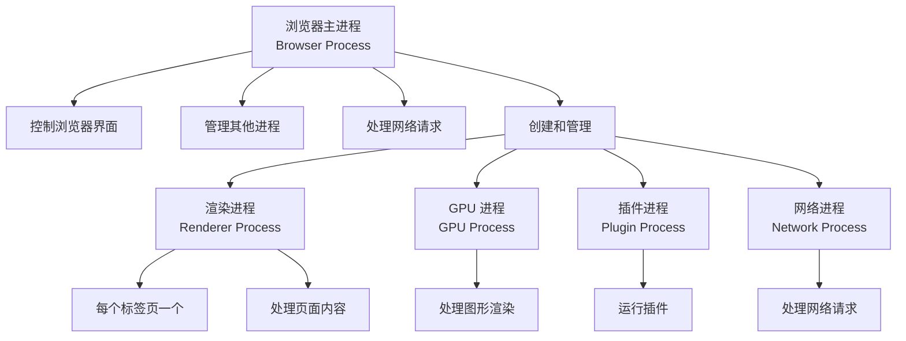
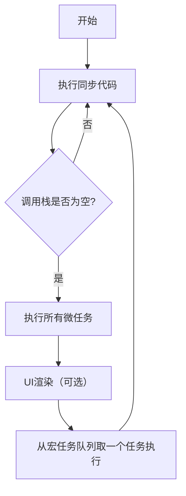
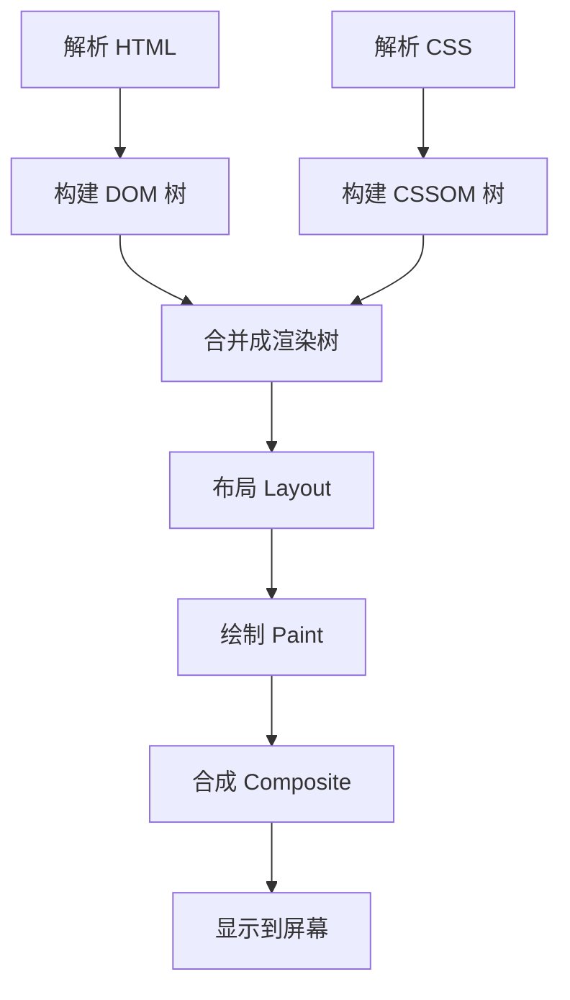

# 浏览器执行机制深入解析

## 核心概念：进程与线程

- **进程 (Process)**：应用程序的启动实例，拥有独立内存空间，是操作系统资源分配的基本单位。进程间相互隔离，一个进程崩溃不会影响其他进程。

- **线程 (Thread)**：进程内的独立执行流，是 CPU 调度的基本单位。线程共享进程的内存空间，可以高效协作。

##### 关系比喻：

进程好比一个工厂，拥有独立厂房和资源；线程好比工厂中的工人，共享工厂资源并协同工作。



## 浏览器的多进程架构

现代浏览器采用多进程架构以提高稳定性、安全性和性能。



## 渲染进程的核心：渲染引擎与 JS 引擎

渲染进程包含多个线程，其中最重要的是：

- **主线程 (Main Thread)**：处理 DOM 构建、样式计算、JavaScript 执行、布局和绘制

- **工作线程 (Worker Threads)**：处理 Web Worker 任务

- **合成线程 (Compositor Thread)**：负责图层合成

- **光栅线程 (Raster Thread)**：负责光栅化处理

## JavaScript 运行机制：Event Loop

JavaScript 使用事件循环机制处理异步操作，其核心组件包括调用栈、Web APIs、任务队列和微任务队列。



### 执行顺序示例

```js
javascript;
console.log("1. Script Start"); // 同步代码

setTimeout(() => {
  console.log("6. setTimeout"); // 宏任务
}, 0);

Promise.resolve()
  .then(() => {
    console.log("4. Promise 1"); // 微任务
  })
  .then(() => {
    console.log("5. Promise 2"); // 微任务
  });

console.log("2. Script End"); // 同步代码

// 输出顺序：
// 1. Script Start
// 2. Script End
// 4. Promise 1
// 5. Promise 2
// 6. setTimeout
```

## 页面渲染流程：从 HTML 到像素

浏览器渲染流程包括以下步骤：



## 渲染优化要点

- **重排 (Reflow)**：修改几何属性，需要重新计算布局（开销最大）

- **重绘 (Repaint)**：修改不影响布局的属性，跳过布局阶段

- **直接合成 (Composite)**：修改仅影响合成的属性（如 transform、opacity），跳过布局和绘制（开销最小）

## 性能优化启示

1. **避免阻塞主线程**

- 优化 JavaScript 执行，拆分长任务
- 使用 Web Worker 处理计算密集型任务

2. **善用事件循环**

- 对高频事件进行防抖或节流
- 使用 setTimeout 推迟非紧急任务
- 减少渲染流水线的范围

3. **避免强制同步布局**

- 使用 class 而非直接操作样式
- 优先使用 CSS 动画和 transform/opacity 属性
- 合理使用 will-change 创建合成层

4. **优化资源加载**

- 使用 async 或 defer 属性加载脚本
